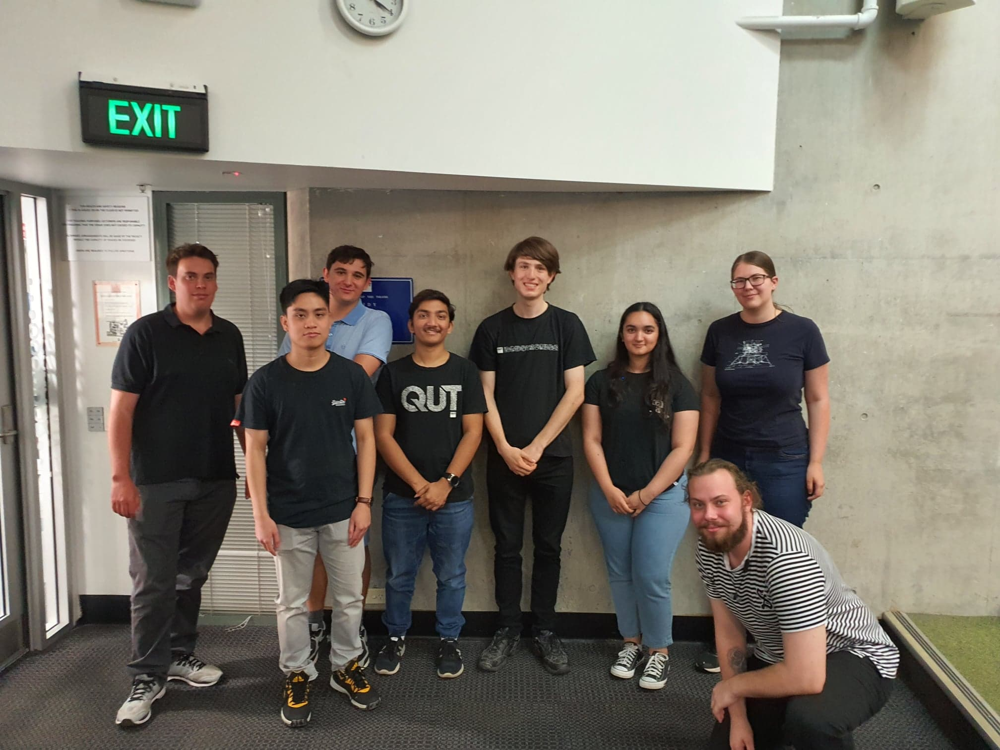

from IPython.display import HTML, display
display(HTML("<table><tr><td></td><td></td></tr></table>"))

The QUT Robotics Club is a student run organisation dedicated to promoting robotics within the QUT community and supporting QUT students’ future in Robotics.

## Our Executives 2020-2021

+ President - Ryan Malone
+ Vice President - Cody Cripps
+ Treasurer - Harrison Giles
+ Secretary - Luigi Jaldon
+ General Executives - Haard Shar, Louis Von Richter, Smriti Bangera, Andrew Razjigaev, Lindsey Paul

## Contact Us
Contact us via qutroboticsclub@gmail.com or get the latest event information from our Facebook [page](https://www.facebook.com/QUTRoboticsClub/)/[group](https://www.facebook.com/groups/qutroboticsclub/).
